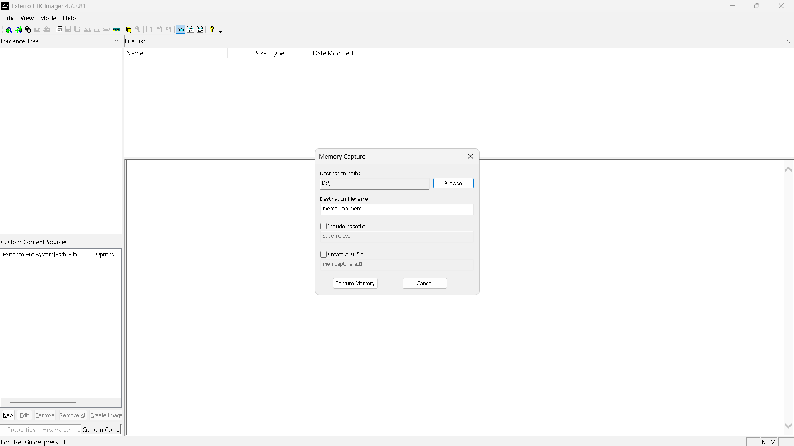
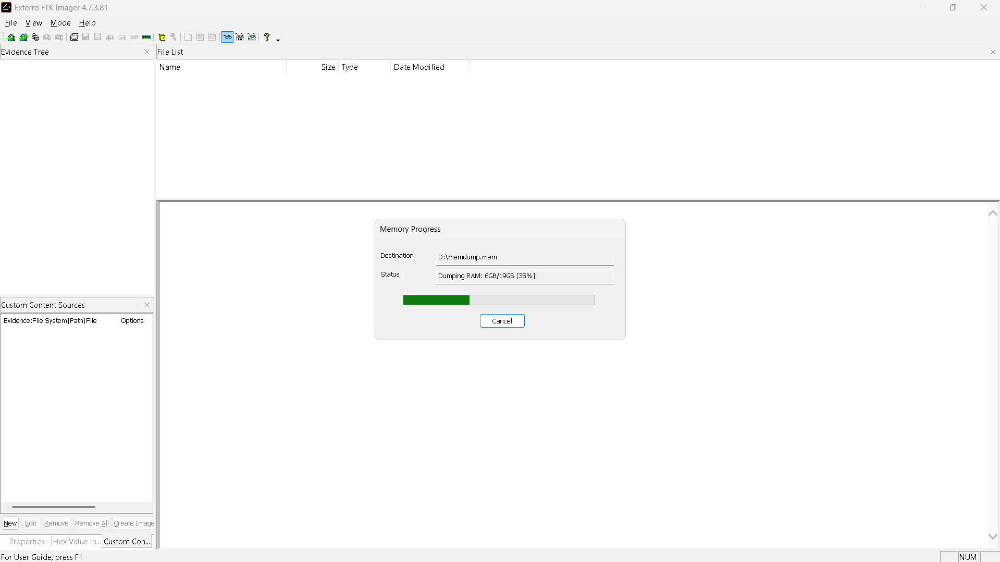

# Ex.No.1    FTK Imager: A Forensic Imaging Tool Overview

## Acquiring Volatile Memory (RAM) Using FTK Imager
 

### Steps to Capture RAM Using FTK Imager
 

### 1. Run as Administrator
- Open **FTK Imager** with administrative privileges.  
- Right-click the FTK Imager icon and select **Run as administrator**.
 
 

 
 
 

### 2. Initiate Memory Capture
- In the top menu bar, click **File → Capture Memory...** from the dropdown list.
   
 

  

 
 

### 3. Configure Destination
A dialog box will appear where you configure where and how the memory will be saved.

- **Destination Path:**  
  Click **Browse** to select a folder on an **external drive** (not the system drive).  

- **Destination Filename:**  
  You can keep the default `memdump.mem` or assign a more descriptive name.

- **Optional: Include pagefile.sys**  
  Check this box to capture `pagefile.sys`, which is virtual memory stored on the disk.  
  > Note: This may increase capture size and duration, but can contain valuable artifacts.

- **Optional: Create AD1 file**  
  Saves the memory dump in an AccessData-specific container file.  
  > Generally not necessary if using tools like **Volatility** for analysis.

 
 

 
 
 

### 4. Start Capture
- Click the **Capture Memory** button to begin acquisition.
 
 

 
 

### 5. Wait for Completion
- A progress bar will indicate the capture status.  
- Capture time depends on the system’s RAM size.  
- Once finished, the memory dump file will be available in the destination folder.
---
 
 

## Acquiring Non-Volatile Memory (Disk Image) Using FTK Imager

### 1. Start the Process
- In FTK Imager, go to the top menu bar: **File → Create Disk Image...**.

 
 

 
 

### 2. Select Source Evidence Type
A window will appear asking you to choose the source type:

- **Physical Drive:** Images the entire disk, including all partitions, unallocated space, and the Master Boot Record (MBR).  
- **Logical Drive:** Images a specific partition (e.g., C: drive).  
- **Image File:** Converts or copies an existing image file.  
- **Contents of a Folder:** Creates an image of a specific folder only.  

> **Tip:** For full forensic imaging, select **Physical Drive**.
 
 

 
 

### 3. Select the Source Drive
- From the dropdown, choose the physical drive to image (connected via **write-blocker**).  
- Click **Finish**.
  
 

 
 

### 4. Configure the Image Destination
- Click **Add...** in the "Create Image" window to define the image **format** and **destination**.
   
 

 

#### Options:

- **Image Type:**  
  - **E01 (EnCase Format):** Recommended; includes compression, metadata, and error-checking.  
  - **Raw (DD):** Bit-for-bit copy with no extra features.
 
 

 
 

- **Fill in Evidence Item Information:**  
  - Enter case details, examiner name, and description.  
  - This information is stored in the image metadata (important for documentation).
 

 
 

- **Choose Destination Folder:**  
  - Must be a different drive from the source.  
  - Name the image file (e.g., `Case001_SuspectHDD`).  

- **Image Fragment Size:**  
  - Set a value to split the image into multiple parts.  
  - Set to `0` for a single image file.
   
   
  

 
 

### 5. Start the Imaging Process
- Click **Finish** to return to the "Create Image" screen.  
- **Check "Verify images after they are created"** to calculate hash values and ensure integrity.  
- Click **Start**.
   
   
  

 

  

 
 

### 6. Completion and Hash Verification
- The imaging process may take time depending on the drive size.  
- After completion, FTK Imager verifies the hashes automatically.  
- A final window shows **MD5** and **SHA1** hashes for both the source drive and image.  
- Matching hashes confirm the forensic image’s integrity.

---
## Notes

- Always use a **write-blocker** to prevent modifications to the evidence.  
- **Hash verification** is critical to maintain a chain of custody and admissibility in court.  
- **Image Fragmentation** is useful for large drives or storage limitations.
---

## References

- [FTK Imager Official Website](https://accessdata.com/product-download/ftk-imager-version-4-5)  
- FTK Imager Documentation
